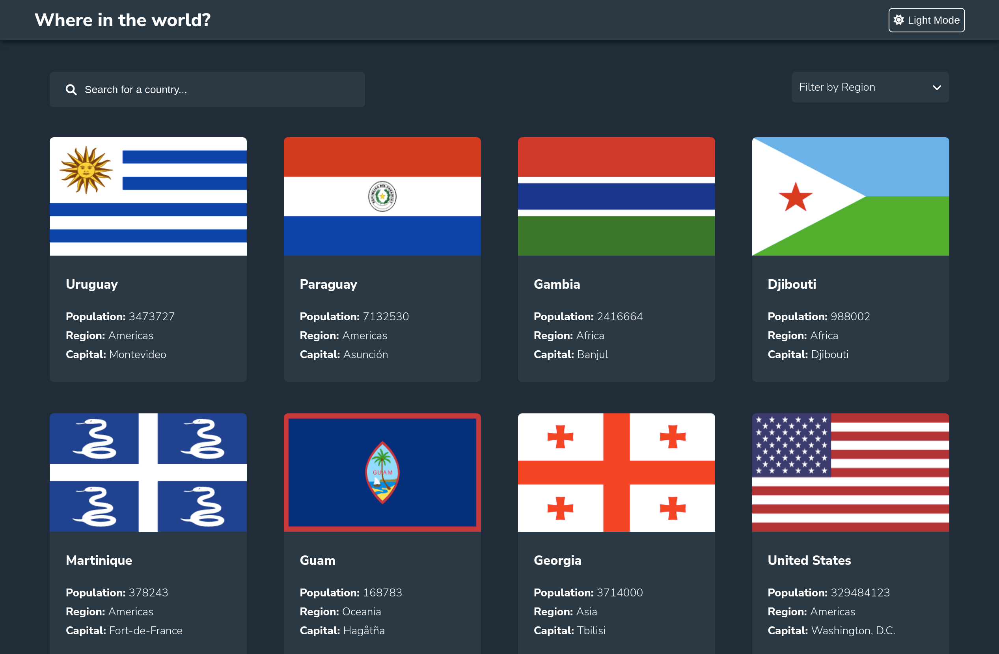
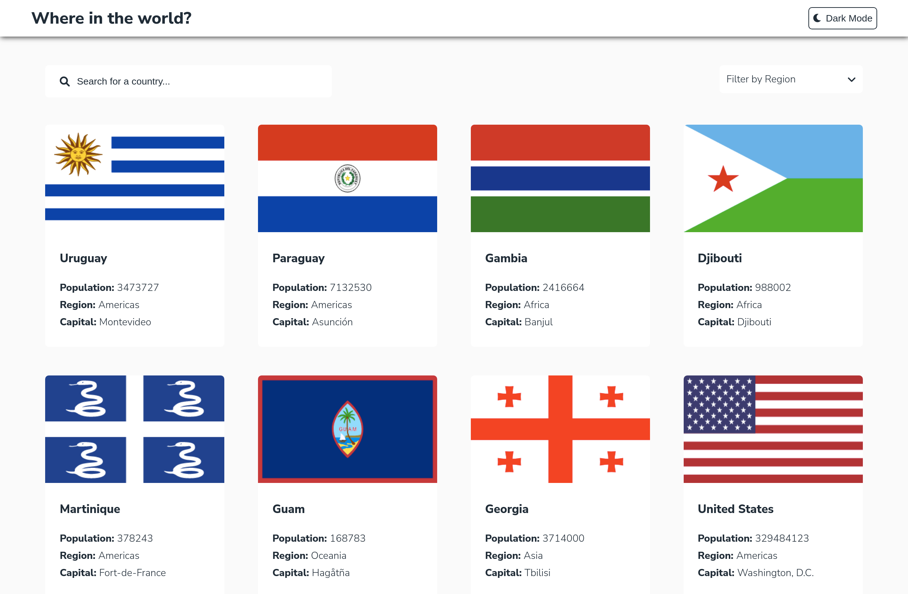
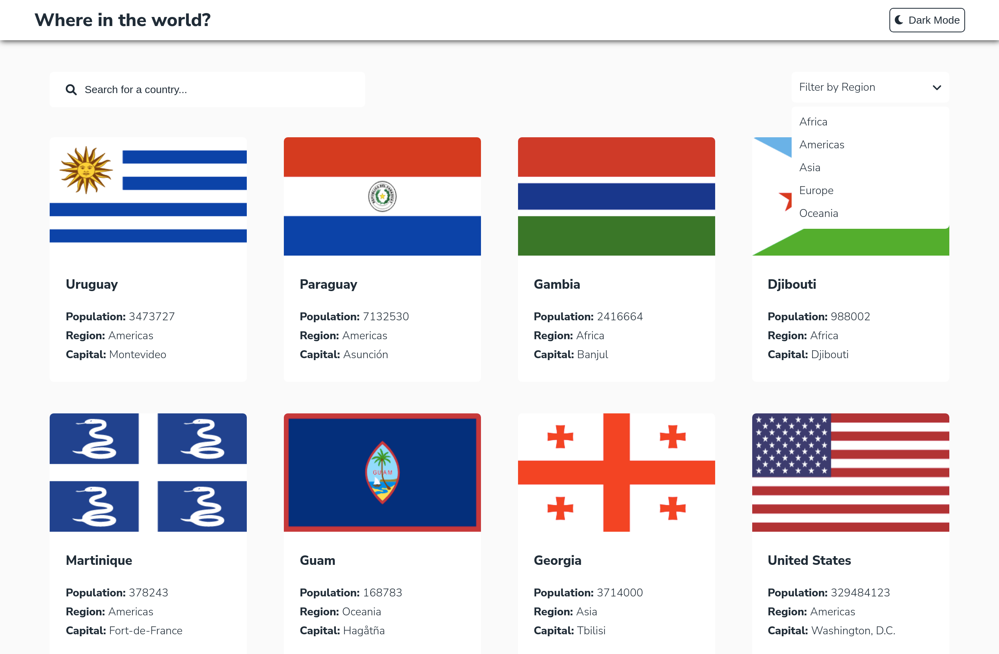
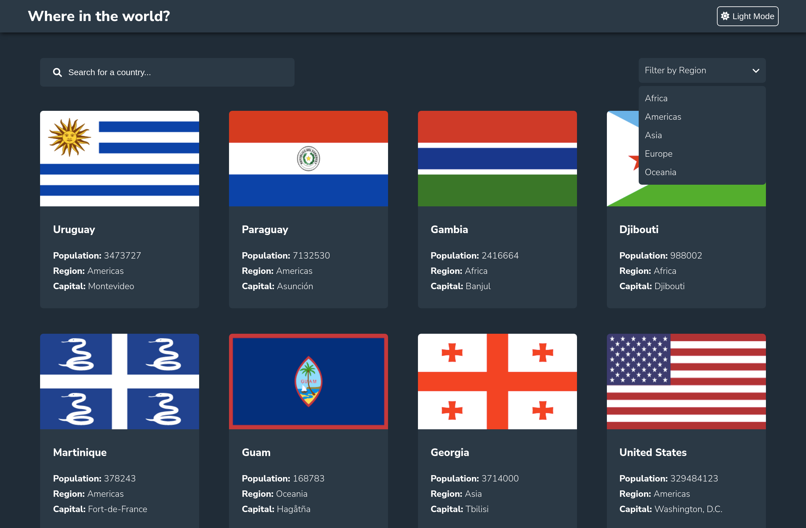
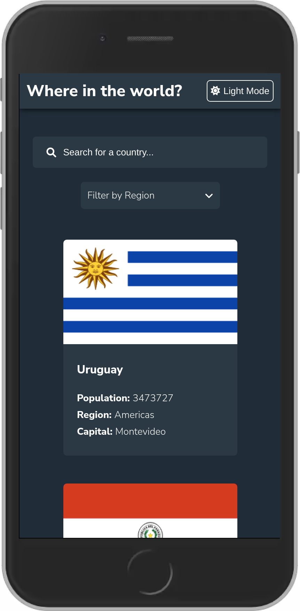
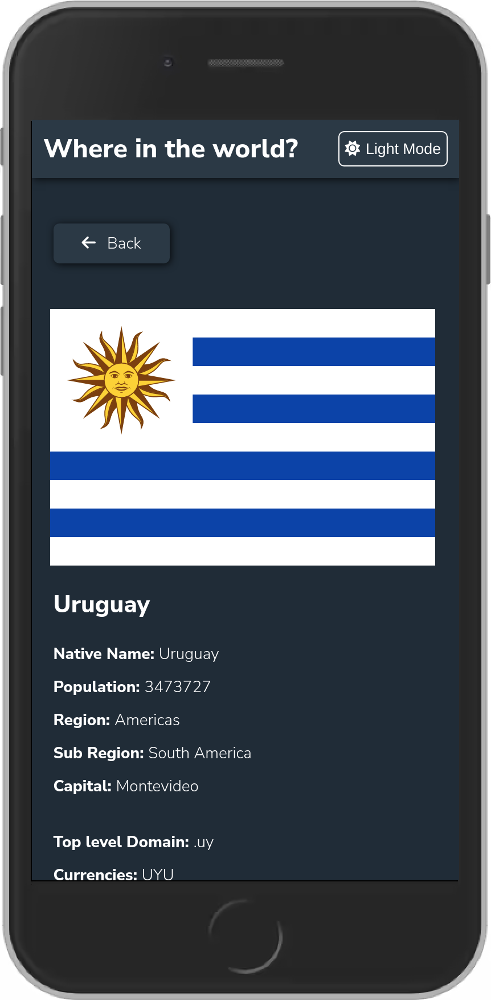
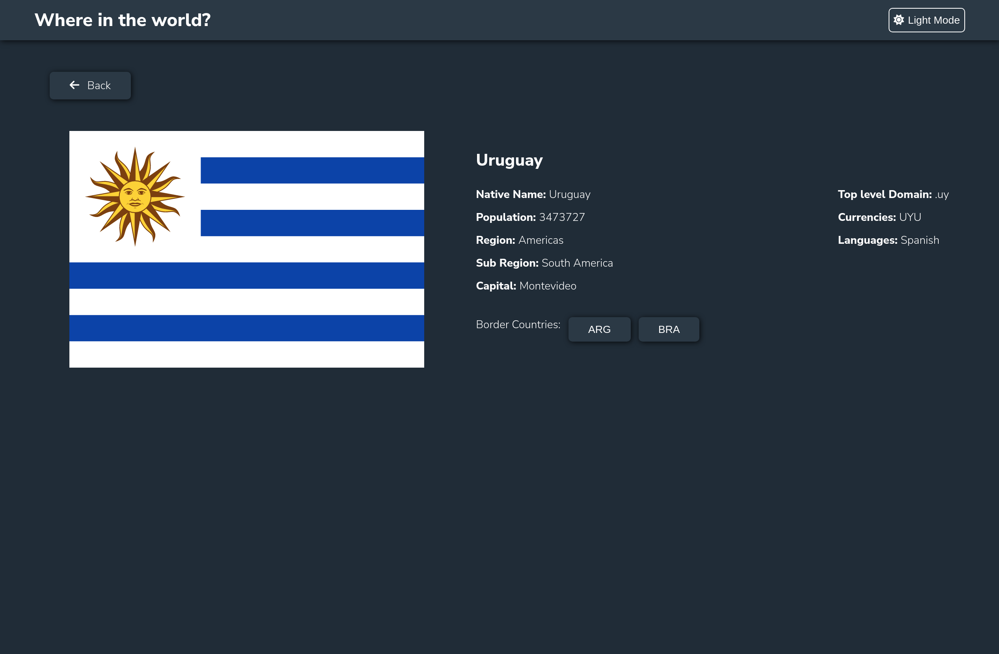

# Frontend Mentor - REST Countries API with color theme switcher solution

This is a solution to the [REST Countries API with color theme switcher challenge on Frontend Mentor](https://www.frontendmentor.io/challenges/rest-countries-api-with-color-theme-switcher-5cacc469fec04111f7b848ca). Frontend Mentor challenges help you improve your coding skills by building realistic projects.

## Table of contents

- [Overview](#overview)
  - [The challenge](#the-challenge)
  - [Screenshot](#screenshot)
  - [Links](#links)
- [My process](#my-process)
  - [Built with](#built-with)
- [Author](#author)
- [Acknowledgments](#acknowledgments)

**Note: Delete this note and update the table of contents based on what sections you keep.**

## Overview

### The challenge

Users should be able to:

- See all countries from the API on the homepage
- Search for a country using an `input` field
- Filter countries by region
- Click on a country to see more detailed information on a separate page
- Click through to the border countries on the detail page
- Toggle the color scheme between light and dark mode _(optional)_

### Links

- Solution URL: [Source Code](https://github.com/waltersono/ecommerce-product-page-main)
- Live Site URL: [View on Browser](https://waltersono.github.io/ecommerce-product-page-main/)

### Built with

- ReactJS
- API
- SASS
- CSS3 Responsive Design
- Semantic HTML5 markup

### Screenshot

## Author

- Frontend Mentor - [@waltersono](https://www.frontendmentor.io/profile/waltersono)
- LinkedIn - [LinkedIn](https://www.linkedin.com/in/waltersono)
